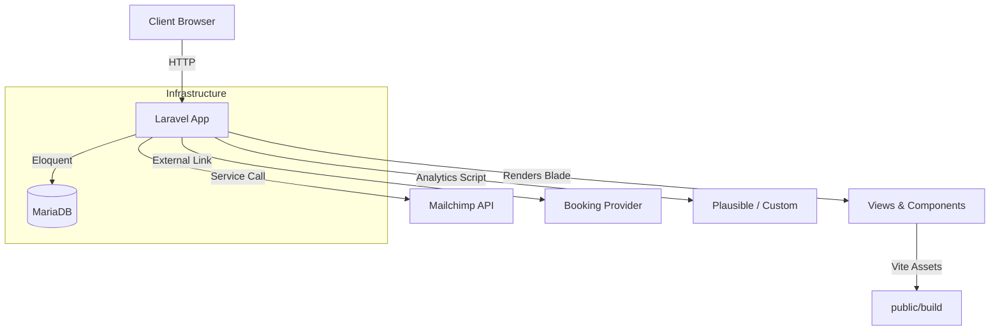

# Project Architecture Document

## 1. Overview
- **Application**: ElderCare SG — Laravel 12 web platform delivering compassionate elderly daycare information for Singaporean families.
- **Audience**: Adult children, caregivers, and healthcare professionals seeking trustworthy day-program solutions.
- **Objectives**: Communicate care philosophy, surface programs/testimonials, enable newsletter/booking funnels, and maintain accessibility + performance excellence per `temp-laravel/Project_Requirements_Document.md`.

## 2. High-Level Architecture

## 3. Technology Stack
- **Backend**: Laravel 12, PHP 8.3.
- **Frontend**: Blade templates, TailwindCSS 3.4 with custom tokens, Alpine.js for interactivity, Embla carousel.
- **Database**: MariaDB/MySQL (`initialize_database.sql` provisions `laravel` DB and `sail` user).
- **Dev Environment**: Laravel Sail (Docker) or local PHP + MySQL with overrides.
- **Build Tooling**: Vite 7, PostCSS, Tailwind.
- **QA Tooling**: `axe-core` CLI, Lighthouse CI, `launch_laravel_dev_server.sh` orchestration script.

## 4. Application Structure
### 4.1 HTTP Layer
- **Routes**: `routes/web.php` defines `/` served by `HomeController` (invokable) and `POST /newsletter` handled by `NewsletterController`.
- **Controllers**:
  - `App\Http\Controllers\HomeController`: Fetches active `Program` and `Testimonial` models, injects booking URL from `BookingService` into `home` view.
  - `App\Http\Controllers\NewsletterController`: Validates email via `NewsletterSubscriptionRequest`, invokes `MailchimpService`, and returns flash messaging.
- **Requests**: `App\Http\Requests\NewsletterSubscriptionRequest` ensures email correctness and future-proofs auth logic.

### 4.2 Domain & Data Layer
- **Models**:
  - `App\Models\Program`: Fillable fields (`name`, `slug`, `description`, etc.), casts `highlights` to array, includes `scopeActive()`.
  - `App\Models\Testimonial`: Captures author metadata, rating, feature flag, `scopeActive()`.
- **Migrations**: `database/migrations/2025_09_30_*` create `programs` and `testimonials` tables; Laravel default migration sets up `sessions` within `create_users_table`.
- **Seeders**: `ProgramSeeder` and `TestimonialSeeder` populate sample content; `DatabaseSeeder` registers both.

### 4.3 Services & Integrations
- **MailchimpService (`app/Services/MailchimpService.php`)**: Calls Mailchimp API when credentials provided; logs failures and gracefully returns `false` if keys missing.
- **BookingService (`app/Services/BookingService.php`)**: Supplies configurable booking URL (`config/services.php` → `services.booking.url`) and logs click context.
- **Analytics Config (`config/analytics.php`)**: Allows enabling Plausible script via env configuration; layout conditionally injects script.

### 4.4 Frontend Composition
- **Layout**: `resources/views/layouts/app.blade.php` sets meta tags, fonts, Vite assets, analytics script, and surrounds content with nav/footer partials.
- **Partials**: `resources/views/partials/nav.blade.php` (header, CTA), `partials/footer.blade.php` (newsletter form, badges, contact info).
- **Landing Page**: `resources/views/home.blade.php` composed of hero, program cards, philosophy section, trust badges, testimonials carousel, tour preview, and booking CTA. Utilizes dynamic data arrays from controllers.
- **Components & JS**:
  - `resources/views/components/hero.blade.php` (hero layout with CTA props).
  - `resources/js/app.js` initializes Alpine and Embla module; `resources/js/modules/carousel.js` exports initializer for carousel.
- **Styling**: Tailwind theme defined in `tailwind.config.js`; base styles in `resources/css/app.css` (with theme fallbacks for canvas/gold colors, global typography, selection styles).

### 4.5 Asset Pipeline
- **Vite**: Configured in `vite.config.js` with Laravel plugin; `npm run dev` for HMR, `npm run build` to emit hashed assets under `public/build/` with manifest consumed by `@vite` directive.
- **PostCSS**: `postcss.config.js` wires Tailwind and Autoprefixer.
- **Build Outputs**: `public/build/assets/app-*.css/js` used by Blade layout; manifest ensures correct versioning in dev/prod.

## 5. Data Flow Examples
### 5.1 Homepage Request
1. Client requests `/` → `HomeController::__invoke()`.
2. Controller queries `Program::active()->orderBy('display_order')` and `Testimonial::active()->orderBy('display_order')`.
3. `BookingService::bookingUrl()` provides CTA link.
4. View `resources/views/home.blade.php` renders sections with data arrays; Blade includes nav/footer partials.
5. Layout loads compiled CSS/JS via `@vite` and optional analytics script.

### 5.2 Newsletter Submission
1. POST `/newsletter` with email.
2. `NewsletterSubscriptionRequest` validates email.
3. `NewsletterController` calls `MailchimpService::subscribe()`.
4. Success → flash `newsletter_status`; failure → flash `newsletter_error` + `old('email')` retention.
5. Footer partial displays messages in aria-live region; logs capture attempts.

## 6. Environment & Deployment
- **Local Dev via Sail**: `./vendor/bin/sail up -d` (Docker containers). `.env` uses `DB_HOST=mysql` for container network.
- **Local Dev via PHP**: Override env per command (e.g., `DB_HOST=127.0.0.1 DB_USERNAME=sail DB_PASSWORD=password php artisan serve`). `launch_laravel_dev_server.sh` automates server start, optional installs, migrations, QA scripts, and log tailing.
- **Database Initialization**: `initialize_database.sql` creates `laravel` database and `sail` user for host-based usage.
- **Asset Build**: `npm run build` prior to `php artisan serve` ensures `public/build/manifest.json` exists.
- **Configuration Files**: `config/services.php` includes Mailchimp and booking sections; `.env` requires `MAILCHIMP_KEY`, `MAILCHIMP_LIST_ID`, `BOOKING_URL`, analytics driver variables for production readiness.

## 7. QA & Automation Pipeline
- **Scripts**: `launch_laravel_dev_server.sh` starts server, optional seeds, runs `npm run lint:accessibility` and `npm run lighthouse`.
- **Accessibility Audit**: `npm run lint:accessibility` leverages axe CLI (current failures due to contrast combinations noted in QA report).
- **Performance Audit**: `npm run lighthouse` uses `lighthouserc.json` to assert minimum scores; reports stored in `storage/app/lighthouse`.
- **Checklist**: `docs/qa/scaffold-checklist.md` records completed verifications, outstanding tasks (contrast fixes, logging checks, automation integration).
- **Future CI**: Plan to integrate scripts into GitHub Actions for automated regression checks.

## 8. Future Enhancements
- **Contrast Remediation**: Update gold/amber styling to meet WCAG AA.
- **Performance Optimization**: Preload hero assets, enable compression, optimize unused CSS/JS flagged by Lighthouse.
- **Interactive Features**: Implement Alpine-driven needs assessment, improved testimonials management, and analytics instrumentation per PRD roadmap.
- **Documentation**: Expand `docs/design-system.md`, `docs/architecture.md`, and `docs/accessibility.md` for comprehensive onboarding.
- **Internationalization**: Consider multilingual support indicated in requirement summaries.

## 9. References
- `temp-laravel/README.md`
- `temp-laravel/Project_Requirements_Document.md`
- `temp-laravel/Understanding_Project_Requirements.md`
- Laravel source under `temp-laravel/` (controllers, models, services, views, scripts)
- QA artifacts: `docs/qa/scaffold-checklist.md`, `launch_laravel_dev_server.sh`, `lighthouserc.json`

---
Prepared 2025-09-30 for onboarding and architectural clarity.
