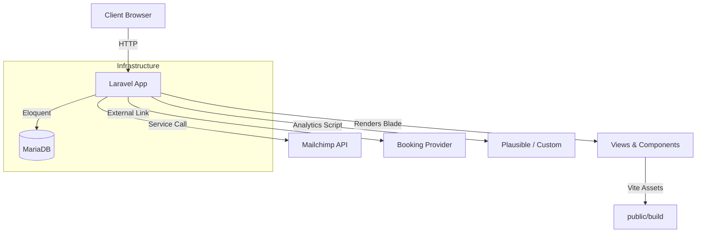
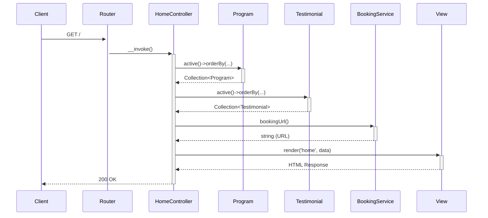

[](https://github.com/nordeim/ElderCare-SG/actions/workflows/qa-ci.yml)
[](./LICENSE)
[](https://www.php.net/)
[](https://nodejs.org/)
[](https://www.docker.com/)

# 👵 ElderCare SG — Compassionate Elderly Daycare Platform

A mission-driven, human-centred portal that brings empathy, clarity, and practical help to families arranging daytime care for their loved ones. ElderCare SG blends warm, reassuring design with clinical credibility—making it simple for adult children, caregivers, and healthcare professionals to discover programs, preview facilities, and confidently schedule visits. Built with a design-first approach and modern tooling (Laravel + TailwindCSS), the platform prioritizes accessibility, performance, and measurable outcomes so families can make informed, dignified choices for eldercare.

---

Table of Contents
- [Vision & Mission](#-vision--mission)
- [Getting Started](#-getting-started)
  - [Recommended Workflow (Docker)](#recommended-workflow-docker)
  - [Alternative Workflow (Local Environment)](#alternative-workflow-local-environment)
- [Production Deployments (Docker Compose)](#production-deployments-docker-compose)
- [Project Architecture & Stack](#-project-architecture--stack)
  - [Technology Stack](#technology-stack)
  - [High-Level Architecture](#high-level-architecture)
  - [Key File Structure](#key-file-structure)
  - [Core Application Flows](#core-application-flows)
- [Design-First Experience](#-design-first-experience)
- [Developer Tooling](#-developer-tooling)
- [Quality Assurance & Testing](#-quality-assurance--testing)
- [Contributing](#-contributing)
- [License](#-license)
- [Phase Progress Highlights](#-phase-progress-highlights)
- [Suggested roadmap](#-suggested-roadmap)

---

## 💡 Vision & Mission

We envision a digital experience that:

- Communicates warmth, reliability, and clinical trustworthiness.
- Helps adult children confidently book care services for their aging parents.
- Brings accessibility and performance best practices into eldercare.

---

## 🚀 Getting Started

This project is designed to run in a Docker container, managed by a simple `Makefile`.

### Recommended Workflow (Docker)

This is the simplest and most reliable way to get the application running.

The application will be available at [http://localhost:8000](http://localhost:8000).

### Alternative Workflow (Local Environment)

If you have a local PHP 8.3 and Node.js 22 environment, you can run the application manually.

1.  **Clone and set up the environment:**
    ```bash
    git clone https://github.com/nordeim/ElderCare-SG.git
    cd ElderCare-SG
    cp .env.example .env
    composer install
    npm install
    ```

2.  **Configure your `.env` file** with your local database and Redis credentials.

3.  **Run key commands and start the servers:**
    ```bash
    php artisan key:generate
    php artisan migrate
    npm run build
    php artisan serve
    ```

---

### Production Deployments (Docker Compose)

For containerized production releases:

1. Populate secrets in `.env.production` (APP_KEY, database credentials, Plausible keys, etc.).
2. Build assets locally or in CI so `public/` contains the hashed bundles (`npm run build`).
3. Run the production stack:
   ```bash
   docker compose -f docker-compose-production.yml up -d
   ```
   This launches PHP-FPM (`app`), Nginx (`nginx`), and supporting services using `.env.production`. Static assets are mounted read-only into both containers, and health checks monitor `/healthz`.

> **Note:** `docker-compose-production.yml` is intended for parity environments. Inject secrets via your CI/CD pipeline rather than committing them to Git.

---

## 🌐 Project Architecture & Stack

### Technology Stack

| Layer | Tech | Version / Confirmation |
|---|---|---|
| Backend | Laravel | `~12.0` (`composer.json`) |
| Language | PHP | `8.3` (`Dockerfile`) |
| Frontend | Blade Templates + TailwindCSS + Alpine.js | `package.json` |
| Database | MariaDB | `10.11` (`docker-compose.yml`) |
| Caching/Queues | Redis | `7.4` (`docker-compose.yml`) |
| Dev Environment | Docker + Node.js | Node `22.x` (`Dockerfile`), `docker-compose.yml`, `Makefile` |
| CI/CD | GitHub Actions (QA pipeline) | `.github/workflows/qa-ci.yml` |

### High-Level Architecture



### Key File Structure

| Path | Description |
|---|---|
| `app/Http/Controllers/` | Handles incoming HTTP requests and delegates to services. |
| `app/Http/Requests/` | Contains Form Request classes for validating incoming data. |
| `app/Models/` | Eloquent models that interact with the database. |
| `app/Services/` | Houses business logic and integrations with external APIs (e.g., Mailchimp). |
| `config/` | Contains all application configuration files. |
| `database/migrations/` | The source of truth for the database schema. |
| `resources/views/` | Blade templates that compose the frontend UI. |
| `routes/web.php` | Defines all web-facing application routes. |
| `docker-compose.yml` | Defines the services, networks, and volumes for the Docker environment. |
| `Makefile` | Provides convenient shortcuts for common Docker and Artisan commands. |

---

## Core Application Flows

#### Homepage Request Flow


#### Newsletter Submission Flow
```mermaid
sequenceDiagram
    participant Client
    participant Router
    participant NewsletterController
    participant NewsletterSubscriptionRequest as Validation
    participant MailchimpService
    participant Session

    Client->>+Router: POST /newsletter (with email)
    Router->>+NewsletterController: __invoke()
    NewsletterController->>+Validation: Validate request
    Validation-->>-NewsletterController: Validated email
    NewsletterController->>+MailchimpService: subscribe(email)
    alt Subscription Successful
        MailchimpService-->>-NewsletterController: true
        NewsletterController->>+Session: flash('newsletter_status', message)
    else Subscription Fails
        MailchimpService-->>-NewsletterController: false
        NewsletterController->>+Session: flash('newsletter_error', message)
    end
    Session-->>-NewsletterController:
    NewsletterController-->>-Client: 302 Redirect Back
```

---

## 🎨 Design-First Experience

This project is crafted using a UI/UX-first approach, where visuals and accessibility are core to success.

📄 Read the full [Project Requirements Document](./Project_Requirements_Document.md).

✨ **Visual Language:**
- **Color palette:** deep blues, warm ambers, calming greens
- **Typography:** Playfair Display (serif), Inter (modern sans-serif)
- **Motion:** micro-interactions, fade-ins, hover effects (prefers-reduced-motion respected)

---

## 🛠️ Developer Tooling

The `Makefile` provides shortcuts for common development tasks.

| Command | Purpose |
|---|---|
| `make up` | Build and start all Docker containers. |
| `make down` | Stop and remove all containers and volumes. |
| `make restart` | Restart the application container. |
| `make logs` | Tail the application container logs. |
| `make bash` | Open a shell inside the application container. |
| `make migrate` | Run database migrations. |
| `make migrate-fresh` | Drop all tables and re-run migrations and seeds. |
| `make test` | Run the PHPUnit test suite. |
| `composer phpunit` | Execute PHPUnit via the project’s bundled runner. |
| `make npm-build` | Build frontend assets for production. |
| `make npm-dev` | Start the Vite development server with HMR. |

---

## 🧪 Quality Assurance & Testing

### Automated Test Suite
- **PHPUnit (Phase 6 focus)**: `php artisan test --group=phase6` covers Mailchimp retries, booking analytics, and resource hub CTA fallbacks (`tests/Feature/*`).
- **Vitest**: `npm run test:js` validates Alpine stores and analytics dispatch logic.
- **Playwright smoke (manual)**: `npm run test:playwright:ci` is available for targeted analytics verification across estimator, FAQ, resources, and prompts (`tests/analytics.spec.ts`).
- **Accessibility audit**: `npm run lint:accessibility` runs axe-core against the dev server via `concurrently`.
- **Lighthouse CI**: `npm run lighthouse:ci` executes the configuration in `lighthouserc.json`; artifacts saved to `storage/app/lighthouse/`.

### Continuous Integration
`qa-ci.yml` orchestrates the core QA suite on every push/PR (PHP 8.3 + Node 22): composer/npm installs, grouped PHPUnit tests, axe CLI, Lighthouse CI, and artifact upload.

### Manual QA & Accessibility Standards
- Follows WCAG 2.1 AA; checklists documented in `docs/qa/scaffold-checklist.md` and `docs/ops/validation_checklist.md`.
- `docs/qa/launch-checklist.md` captures launch gating tasks (analytics verification, backups, rollback plan).
- Known performance warnings (FCP/LCP/CLS) tracked in `docs/notes/performance-2025-10-01.md` as backlog work.

---

## 🤝 Contributing

We welcome thoughtful contributions — accessibility, performance, UI polish, or feature ideas! Please check our (forthcoming) `CONTRIBUTING.md` for full details.

---

## 📄 License

MIT License © 2025 Nordeim

---

## 📈 Phase Progress Highlights

- **Phase 4 – Guided Needs Assessment Delivery**: Interactive questionnaire, `AssessmentService`, and personalization stores shipped (`resources/views/components/assessment.blade.php`, `resources/js/modules/assessment.js`).
- **Phase 5 – Design System & Component Docs**: Semantic Tailwind tokens and fluid typography shipped (`tailwind.config.js`, `resources/css/app.css`); `docs/components.md` catalog component usage.
- **Phase 6 – Data & Integration Hardening**: Seeders enriched, analytics logging routed through dedicated `analytics` channel, Plausible goals wired, and validation docs/tests added (`docs/ops/validation_checklist.md`).
- **Phase 7 – QA Automation & Launch Readiness**: GitHub Actions pipeline, accessibility audits, and launch checklist established; QA documentation refreshed (`docs/qa/launch-checklist.md`).

---

## 🔭 Suggested roadmap

- **Phase 8 – Guided Assessment Enhancements**: Deepen segmentation logic and analytics instrumentation on the shipped assessment workflow.
- **Phase 9 – CMS & Content Ops**: Introduce editorial tooling (Nova/Filament) so non-engineers manage programs, testimonials, and resources.
- **Phase 10 – Performance Remediation**: Address Lighthouse warnings (FCP/LCP/CLS, console errors) via caching, bundle splitting, and layout optimization.
- **Phase 11 – Localization & Accessibility Depth**: Expand language support (Malay/Tamil), conduct assistive tech regression tests, and document ARIA patterns.
- **Phase 12 – Launch & Post-Launch Analytics**: Finalize go-live playbook, enable feature flags for staged rollout, and set up weekly analytics cadence.

---