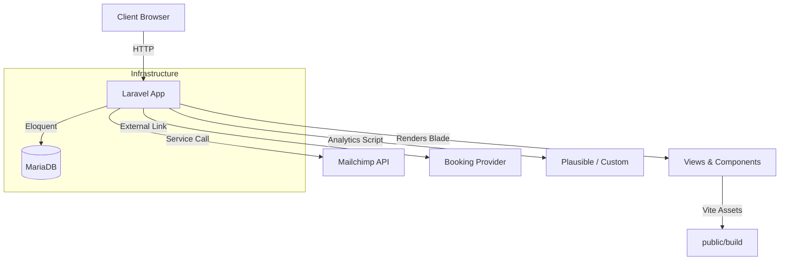
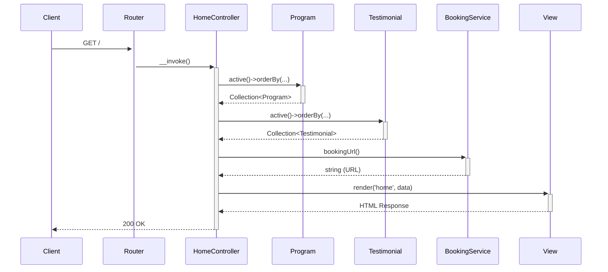

# 👵 ElderCare SG — Compassionate Elderly Daycare Platform

Where compassionate care meets modern comfort for every family.

ElderCare SG is a modern, accessible, and emotionally thoughtful web platform designed for families in Singapore seeking trusted elderly daycare services. Built with Laravel, TailwindCSS, and a design-first approach, it aims to provide a seamless and reassuring digital experience.

---

## 💡 Vision & Mission

We envision a digital experience that:

- Communicates warmth, reliability, and clinical trustworthiness.
- Helps adult children confidently book care services for their aging parents.
- Brings accessibility and performance best practices into eldercare.

---

## 🚀 Getting Started

This project is designed to run in a Docker container, managed by a simple `Makefile`.

### Recommended Workflow (Docker)

This is the simplest and most reliable way to get the application running.

1.  **Clone the repository:**
    ```bash
    git clone https://github.com/nordeim/ElderCare-SG.git
    cd ElderCare-SG
    ```

2.  **Build and run the application:**
    ```bash
    make up
    ```
    This single command builds the Docker images, starts all necessary services (application, database, Redis), and runs database migrations automatically via the entrypoint script.

The application will be available at [http://localhost:8000](http://localhost:8000).

### Alternative Workflow (Local Environment)

If you have a local PHP and Node.js environment, you can run the application manually.

1.  **Clone and set up the environment:**
    ```bash
    git clone https://github.com/nordeim/ElderCare-SG.git
    cd ElderCare-SG
    cp .env.example .env
    composer install
    npm install
    ```

2.  **Configure your `.env` file** with your local database and Redis credentials.

3.  **Run key commands and start the servers:**
    ```bash
    php artisan key:generate
    php artisan migrate
    npm run build
    php artisan serve
    ```

---

## 🌐 Project Architecture & Stack

### Technology Stack

| Layer | Tech | Version / Confirmation |
|---|---|---|
| Backend | Laravel | `~12.0` (`composer.json`) |
| Language | PHP | `8.3` (`Dockerfile`) |
| Frontend | Blade Templates + TailwindCSS + Alpine.js | `package.json` |
| Database | MariaDB | `10.11` (`docker-compose.yml`) |
| Caching/Queues | Redis | `7.4` (`docker-compose.yml`) |
| Dev Environment | Docker | `docker-compose.yml`, `Makefile` |
| CI/CD | Not yet implemented | N/A |

### High-Level Architecture



### Key File Structure

| Path | Description |
|---|---|
| `app/Http/Controllers/` | Handles incoming HTTP requests and delegates to services. |
| `app/Http/Requests/` | Contains Form Request classes for validating incoming data. |
| `app/Models/` | Eloquent models that interact with the database. |
| `app/Services/` | Houses business logic and integrations with external APIs (e.g., Mailchimp). |
| `config/` | Contains all application configuration files. |
| `database/migrations/` | The source of truth for the database schema. |
| `resources/views/` | Blade templates that compose the frontend UI. |
| `routes/web.php` | Defines all web-facing application routes. |
| `docker-compose.yml` | Defines the services, networks, and volumes for the Docker environment. |
| `Makefile` | Provides convenient shortcuts for common Docker and Artisan commands. |

### Core Application Flows

#### Homepage Request Flow


#### Newsletter Submission Flow
```mermaid
sequenceDiagram
    participant Client
    participant Router
    participant NewsletterController
    participant NewsletterSubscriptionRequest as Validation
    participant MailchimpService
    participant Session

    Client->>+Router: POST /newsletter (with email)
    Router->>+NewsletterController: __invoke()
    NewsletterController->>+Validation: Validate request
    Validation-->>-NewsletterController: Validated email
    NewsletterController->>+MailchimpService: subscribe(email)
    alt Subscription Successful
        MailchimpService-->>-NewsletterController: true
        NewsletterController->>+Session: flash('newsletter_status', message)
    else Subscription Fails
        MailchimpService-->>-NewsletterController: false
        NewsletterController->>+Session: flash('newsletter_error', message)
    end
    Session-->>-NewsletterController:
    NewsletterController-->>-Client: 302 Redirect Back
```

---

## 🎨 Design-First Experience

This project is crafted using a UI/UX-first approach, where visuals and accessibility are core to success.

📄 Read the full [Project Requirements Document](./Project_Requirements_Document.md).

✨ **Visual Language:**
- **Color palette:** deep blues, warm ambers, calming greens
- **Typography:** Playfair Display (serif), Inter (modern sans-serif)
- **Motion:** micro-interactions, fade-ins, hover effects (prefers-reduced-motion respected)

---

## 🛠️ Developer Tooling

The `Makefile` provides shortcuts for common development tasks.

| Command | Purpose |
|---|---|
| `make up` | Build and start all Docker containers. |
| `make down` | Stop and remove all containers and volumes. |
| `make restart` | Restart the application container. |
| `make logs` | Tail the application container logs. |
| `make bash` | Open a shell inside the application container. |
| `make migrate` | Run database migrations. |
| `make migrate-fresh` | Drop all tables and re-run migrations and seeds. |
| `make test` | Run the PHPUnit test suite. |
| `make npm-build` | Build frontend assets for production. |
| `make npm-dev` | Start the Vite development server with HMR. |

---

## 🧪 QA & Accessibility

This project adheres to WCAG 2.1 AA standards.

- ✅ Color contrast checked
- ✅ Keyboard navigability for all components
- ✅ Screen reader accessibility for interactive elements
- ✅ `prefers-reduced-motion` respected
- ✅ Lighthouse score target: >90 on mobile and desktop

---

## 🤝 Contributing

We welcome thoughtful contributions — accessibility, performance, UI polish, or feature ideas! Please check our (forthcoming) `CONTRIBUTING.md` for full details.

---

## 📄 License

MIT License © 2025 Nordeim